STEP 1- BACKEND CONFIGURATION

First, I updated and upgraded the Ubuntu server to the latest version with the following commands:

`sudo apt update`

`sudo apt upgrade`

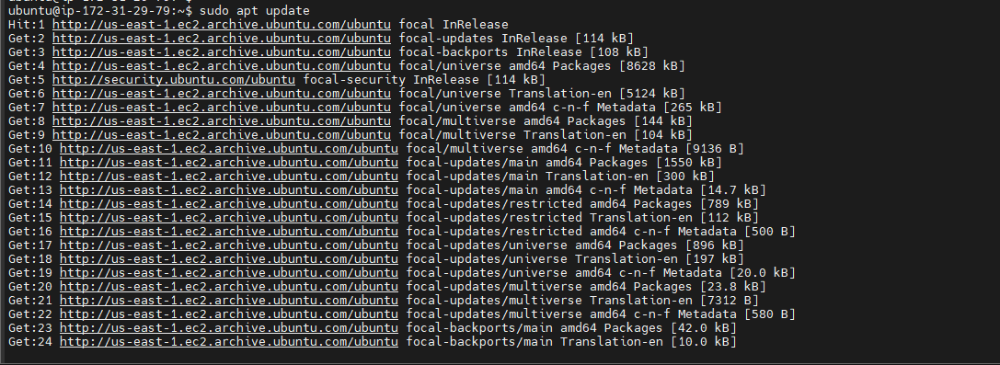

The code below was used to get the location of Node.js software from Ubuntu repositories:

`curl -sL https://deb.nodesource.com/setup_12.x | sudo -E bash -`

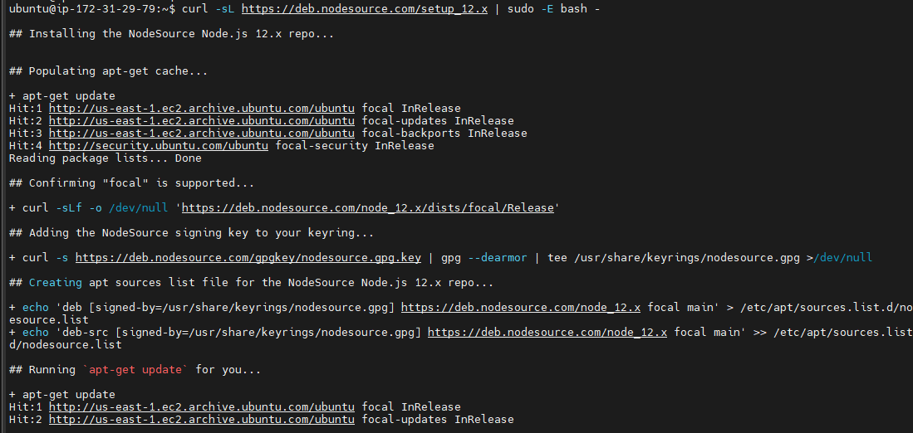

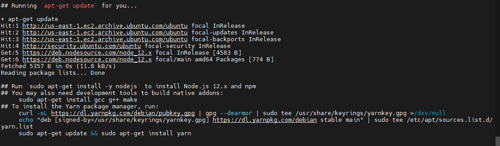

Installed Node.js on the server using the code below. This command also installs npm:

`sudo apt-get install -y nodejs`

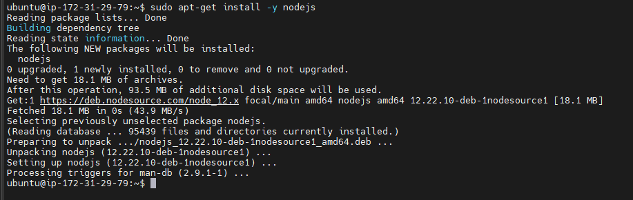

The node installation (node.js and npm) was  verified by running the codes below:

`node -v `

`npm -v `

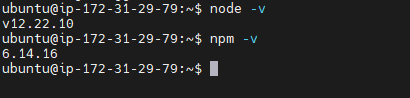

I created a new directory named "todo" then ran a command to verify the directory was created and then changed from my current directory into the nwely created "todo" directory:

`mkdir Todo `

`ls `

`cd Todo`

the command below was used to intialize the projectso that a new file named package json will be created.This file conatins information about the application and the dependencies it needs to run.

A verification was then perfomed to confirm the package json was created:

`npm init`

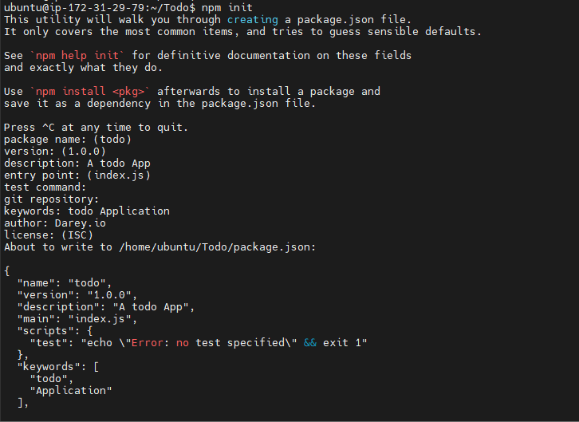

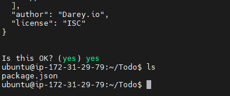

These commands will install Express using npm and then create a file named index.js:

`npm install express`

`touch index.js`

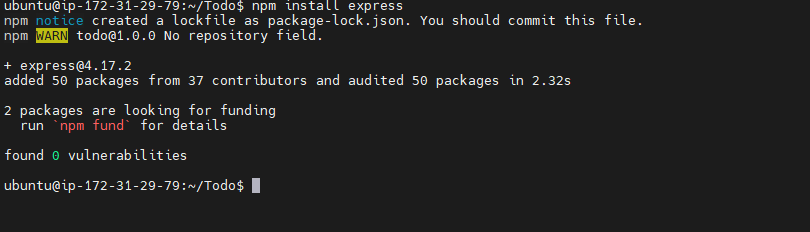

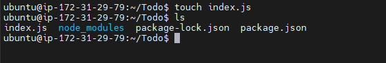

Next, the dotenv module will be installed then that index.js file opened. The code wriiten below will be saved inside the index.js file.

`npm install dotenv`

`vim index.js`

`const express = require('express');
require('dotenv').config();

const app = express();

const port = process.env.PORT || 5000;

app.use((req, res, next) => {
res.header("Access-Control-Allow-Origin", "\*");
res.header("Access-Control-Allow-Headers", "Origin, X-Requested-With, Content-Type, Accept");
next();
});

app.use((req, res, next) => {
res.send('Welcome to Express');
});

app.listen(port, () => {
console.log(`Server running on port ${port}`)
});`

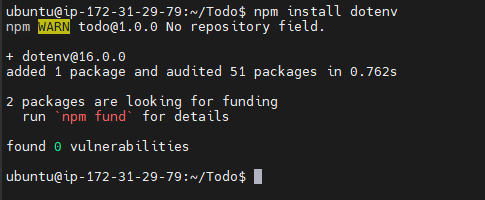

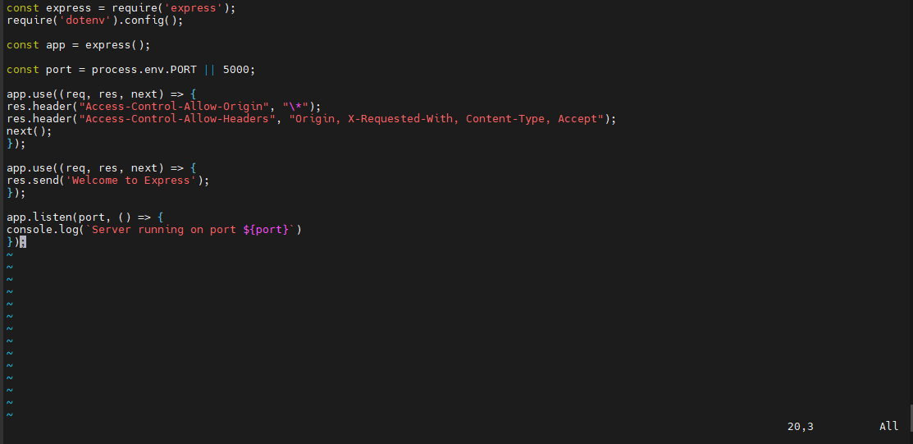

From the code above, port 5000 has been specified to be used. This will be confirmed when the terminal is opened from the index.js directory.

`node index.js`

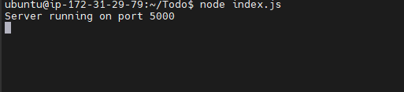

Port 5000 was opened from the ECS security group on the EC2 AWS management console. I opened my browser to confirm access to my servers IP address followed by port 5000

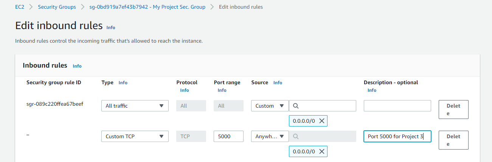

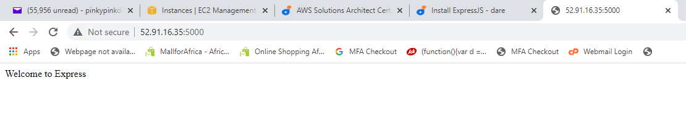

In this next step, the Todo application will be shown to perform:
1. Create a new task
2. Display lists of all tasks
3. Delete a completed task

For each tasks, routes will be created that will define various end points that the todo app will depend on.

First, a folder called routes is created. Then we change from our current directory into the routes directory. Then a file named api.js is created.

`mkdir routes`

`cd routes`

`touch api.js`

The file api.js is opened and the following code is saved in it.

`vim api.js`

`const express = require ('express');
const router = express.Router();

router.get('/todos', (req, res, next) => {

});

router.post('/todos', (req, res, next) => {

});

router.delete('/todos/:id', (req, res, next) => {

})

module.exports = router;`

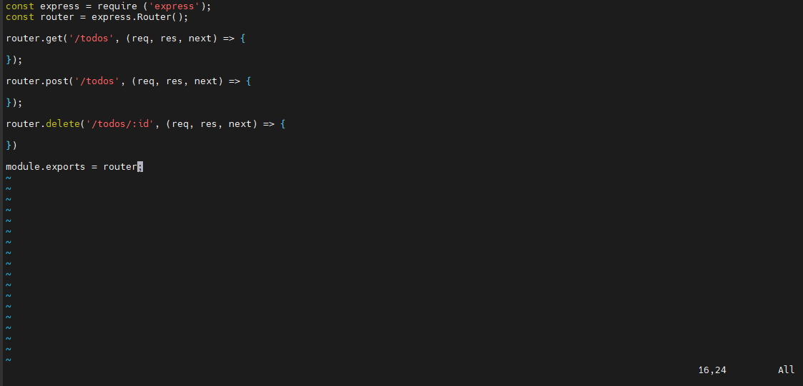

To install Mongoose, the dircectory will be changed from routes to todo. Mongoose is then installed with the command below:

`npm install mongoose`

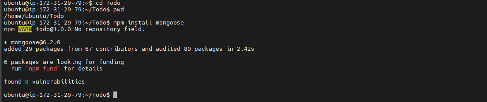

A new folder named "models" is created. Directory is changed into the newly created "models" folder and then a file named todo.js is created inside the "models" folder using the command below:

`mkdir models && cd models && touch todo.js`

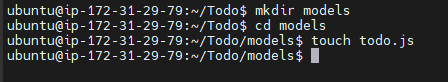

The file todo.js is opened and the code below is saved inside it.

`vim todo.js`

`const mongoose = require('mongoose');
const Schema = mongoose.Schema;

//create schema for todo
const TodoSchema = new Schema({
action: {
type: String,
required: [true, 'The todo text field is required']
}
})

//create model for todo
const Todo = mongoose.model('todo', TodoSchema);

module.exports = Todo;`

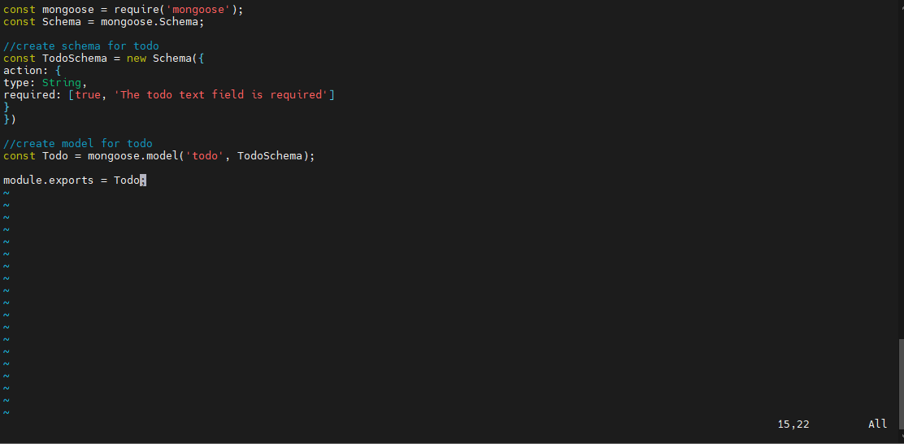

Next, the routes from the file api.js will be updated. Fisrt, from the the routes directory, the api.js file is opened and its present content deleted and the code below will be saved inside the file.

`vim api.js`

`const express = require ('express');
const router = express.Router();
const Todo = require('../models/todo');

router.get('/todos', (req, res, next) => {

//this will return all the data, exposing only the id and action field to the client
Todo.find({}, 'action')
.then(data => res.json(data))
.catch(next)
});

router.post('/todos', (req, res, next) => {
if(req.body.action){
Todo.create(req.body)
.then(data => res.json(data))
.catch(next)
}else {
res.json({
error: "The input field is empty"
})
}
});

router.delete('/todos/:id', (req, res, next) => {
Todo.findOneAndDelete({"_id": req.params.id})
.then(data => res.json(data))
.catch(next)
})

module.exports = router;`

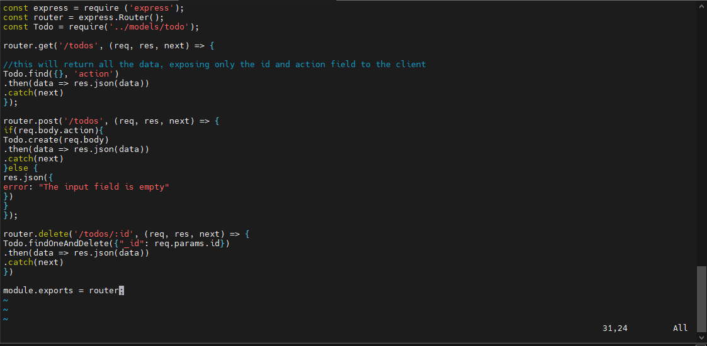

A database is needed tp store data. Mlab provides MongoDB database as a service solution. To make this work i signd up for  shared clusters free account and completed the get started checklist.

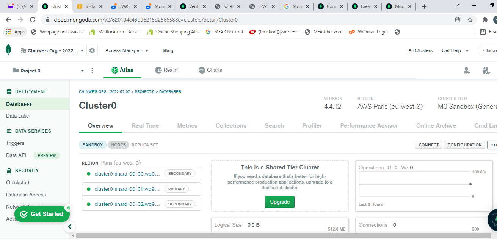

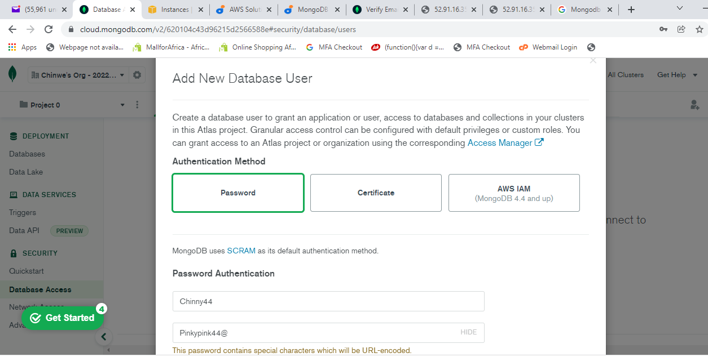

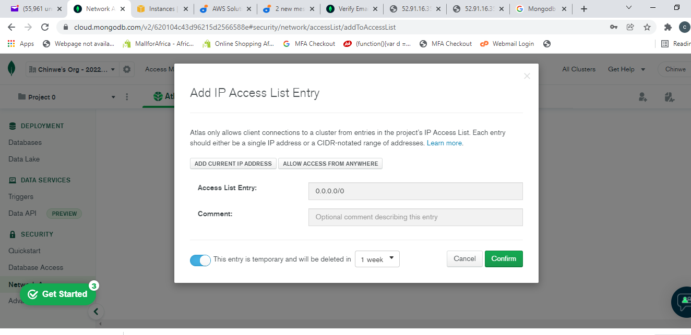

Ealier, in the index.js file, dotenv was specified to access environment variables but the file was no created. The file shall be created now.

 A file named .env is created in the todo directory. This file is opened and a connaction string gotten from the clusters (see format below) free account is saved inside it.

 `touch .env`

 `vi .env`

 DB = 'mongodb+srv://<username>:<password>@<network-address>/<dbname>?retryWrites=true&w=majority'

 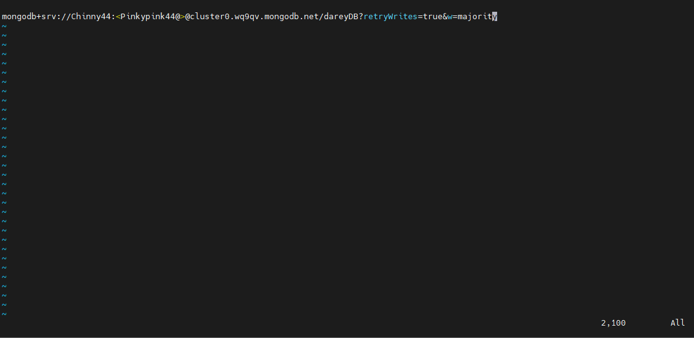

 The index.js file needs to be updated to reflect the use of .env so that nodejs can connect to the database.

 To update the index.js file; Open the file, 

 `vim index.js`

Delete contents and save the following code inside it, 

 `const express = require('express');
const bodyParser = require('body-parser');
const mongoose = require('mongoose');
const routes = require('./routes/api');
const path = require('path');
require('dotenv').config();

const app = express();

const port = process.env.PORT || 5000;

//connect to the database
mongoose.connect(process.env.DB, { useNewUrlParser: true, useUnifiedTopology: true })
.then(() => console.log(`Database connected successfully`))
.catch(err => console.log(err));

//since mongoose promise is depreciated, we overide it with node's promise
mongoose.Promise = global.Promise;

app.use((req, res, next) => {
res.header("Access-Control-Allow-Origin", "\*");
res.header("Access-Control-Allow-Headers", "Origin, X-Requested-With, Content-Type, Accept");
next();
});

app.use(bodyParser.json());

app.use('/api', routes);

app.use((err, req, res, next) => {
console.log(err);
next();
});

app.listen(port, () => {
console.log(`Server running on port ${port}`)
});`

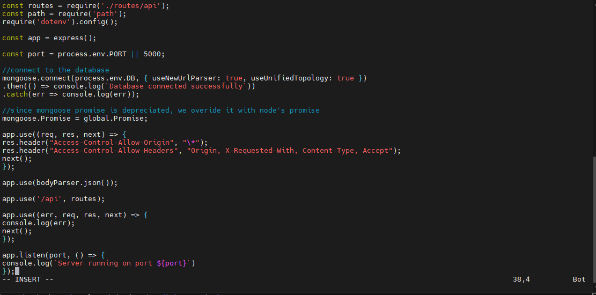

The server ran susccessfully and strting it using the following command.

`node index.js`

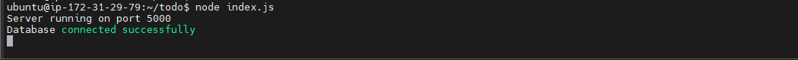

So far, the backend code of out todo application has been wriiten and a database configured. This code will be tested using RESTful API.

POSTMAN wil be installed and used to test the API. 

A POST request to the API was created in POSTMAN with URL format below. This request will send a new task to the todo list and store it in the database . 

http://<PublicIP-or-PublicDNS>:5000/api/todos..

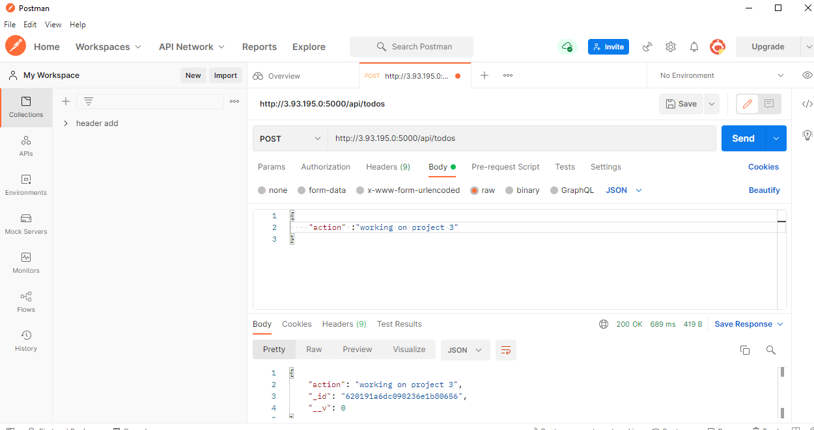

A GET request was created to the API with the URL format below. This request retrieves all existing records from the Todo application (backend requests these records from the database and sends it back as a response to GET request).

http://<PublicIP-or-PublicDNS>:5000/api/todos..

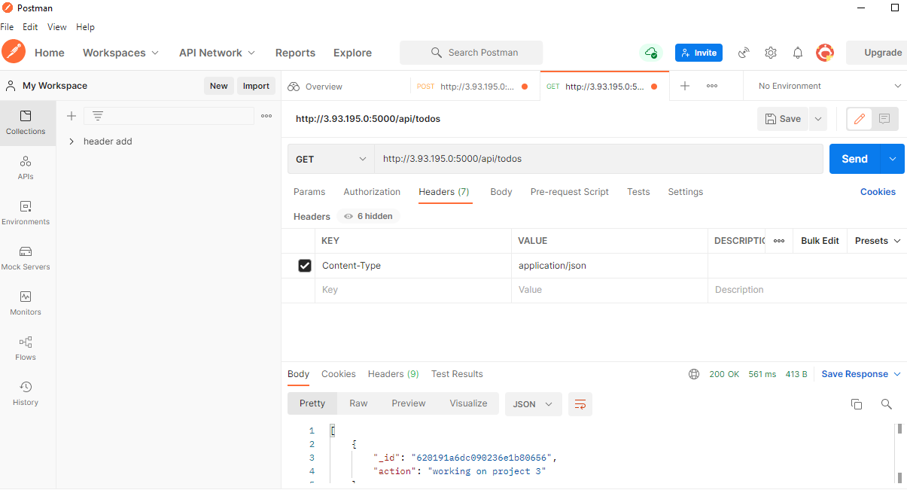

The above shows that the backend part of the todo application have been tested and supports the operations that we wanted :

- Display a list of tasks – HTTP GET request
- Add a new task to the list – HTTP POST request

STEP 2- FRONTEND CREATION

It is now time to create a user interface for a Web client (browser) to interact with the application via API.

The command below was used to start out with the frontend of the todo app. This command ran in the todo directory, was used to scaffold the app.

`npx create-react-app client`

This created a folder in the todo directory named client, were all the react code was saved in.

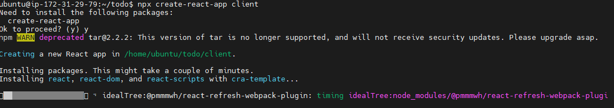

Before testing the react app. some dependencies, concurrently and nodemon were installed.

`npm install concurrently --save-dev`

`npm install nodemon --save-dev`

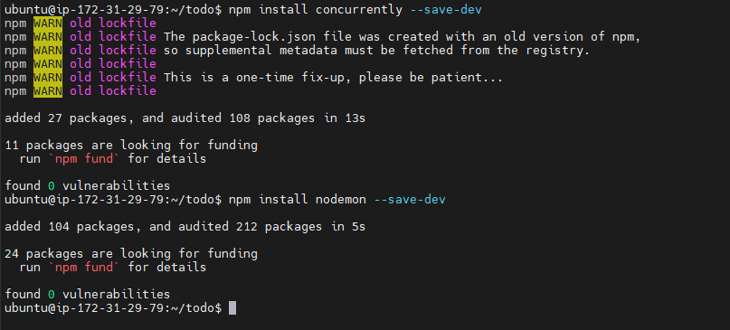

Concurrently is used to run more than one command simultaneously from the same terminal window and nodemon is used to run and monitor the server. If there is any change in the server code, nodemon will restart it automatically and load the new changes.

The Package.json file was opened in the todo folder. The circled part was deleted and following code was added and saved in the folder .

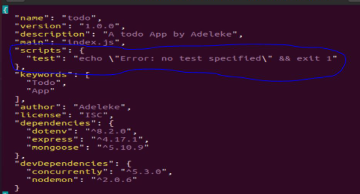

`"scripts": {
"start": "node index.js",
"start-watch": "nodemon index.js",
"dev": "concurrently \"npm run start-watch\" \"cd client && npm start\""
},`

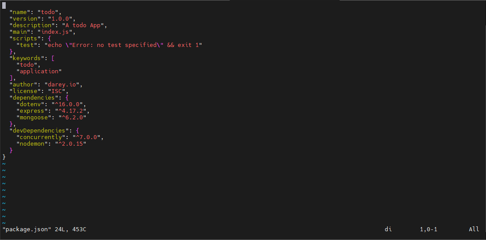

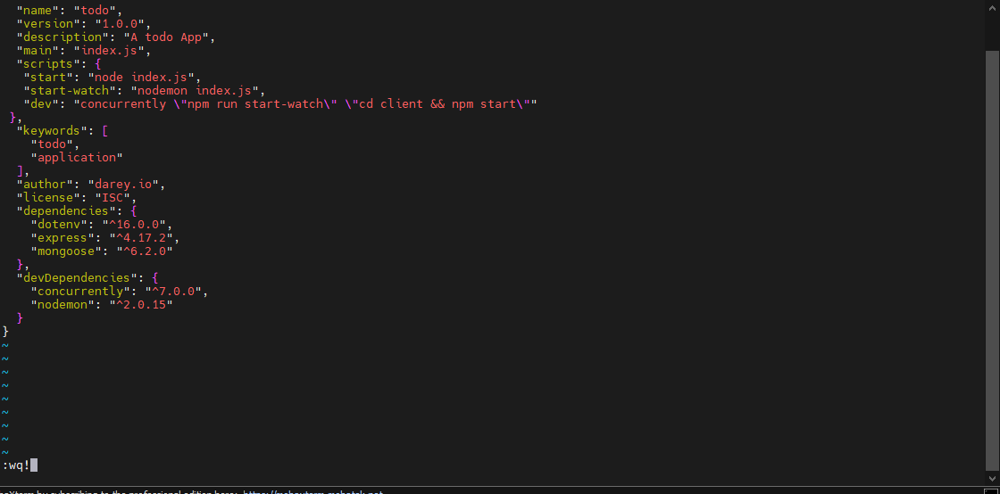

To configure proxy in the package.json file, the package.json file will be opened from the client directory

`cd client`

`vi package.json`

Next, the key value pair "proxy": "http://localhost:5000" is added into the package.jsaon file and saved.

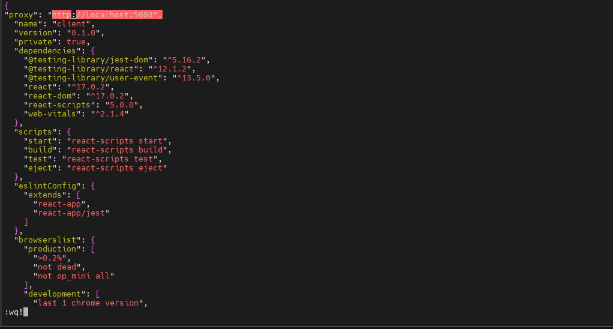

The whole purpose of adding the proxy configuration in number 3 above makes it possible to access the application directly from the browser by simply calling the server url like http://localhost:5000 rather than always including the entire path like http://localhost:5000/api/todos.

To be able to access the application from the internet, Port 3000 was opened from the ECS security group on the EC2 AWS management console. 

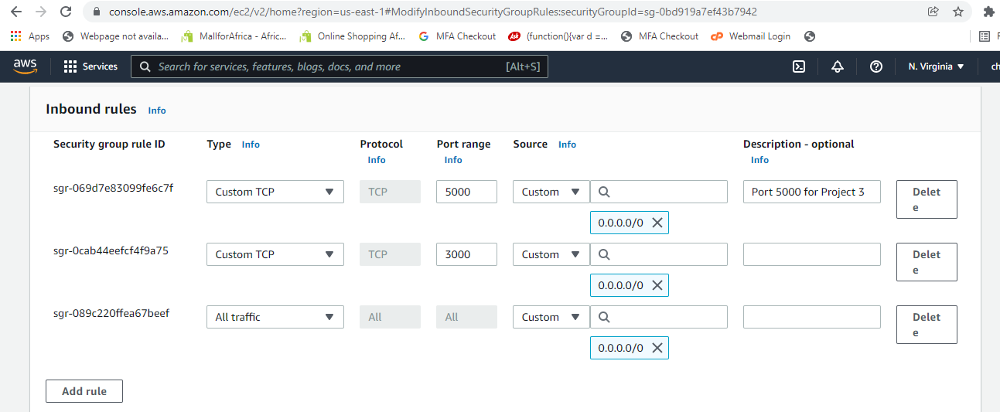

This next command was run from the todo directory and the screen shot that follows shows the app is open and running on 
localhost:3000

`npm run dev`

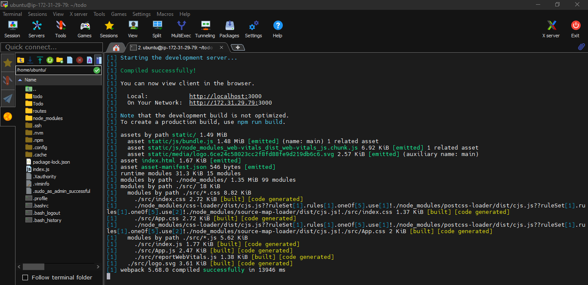

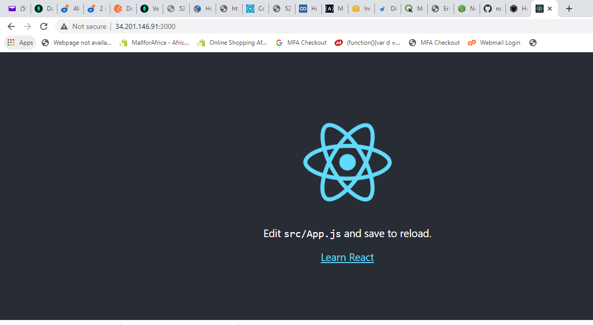

To create the react components, I ran the following commands to get started:

`cd client`

`cd src`

`mkdir components`

`cd components`

`touch Input.js ListTodo.js Todo.js`

The screen shot below shows the three files input.js, listTodo.js and Todo.js files created in the components directory.

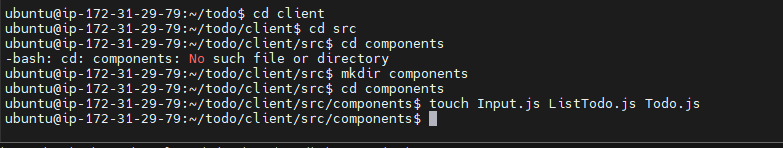

Next, the input.js file was opened had the following code saved inside

`vi Input.js`

`import React, { Component } from 'react';
import axios from 'axios';

class Input extends Component {

state = {
action: ""
}

addTodo = () => {
const task = {action: this.state.action}

    if(task.action && task.action.length > 0){
      axios.post('/api/todos', task)
        .then(res => {
          if(res.data){
            this.props.getTodos();
            this.setState({action: ""})
          }
        })
        .catch(err => console.log(err))
    }else {
      console.log('input field required')
    }

}

handleChange = (e) => {
this.setState({
action: e.target.value
})
}

render() {
let { action } = this.state;
return (

<input type="text" onChange={this.handleChange} value={action} />
<button onClick={this.addTodo}>add todo</button>

)
}
}

export default Input`

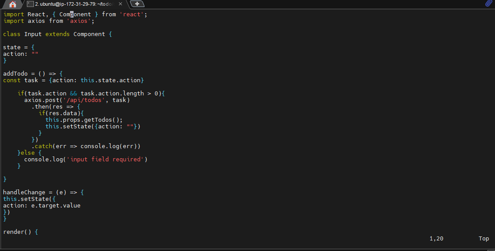

Axios is a Promise based HTTP client for the browser and node.js. To install Axios, i changed into the client directory. 

Then ran the following command:

`npm install axios`

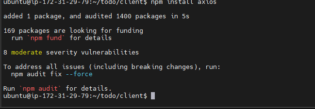

Going back into the components directory, I opned the listtodo.js file and saved the following code inside it.

`vi ListTodo.js`

`import React from 'react';

const ListTodo = ({ todos, deleteTodo }) => {

return (
<ul>
{
todos &&
todos.length > 0 ?
(
todos.map(todo => {
return (
<li key={todo._id} onClick={() => deleteTodo(todo._id)}>{todo.action}</li>
)
})
)
:
(
<li>No todo(s) left</li>
)
}
</ul>
)
}

export default ListTodo

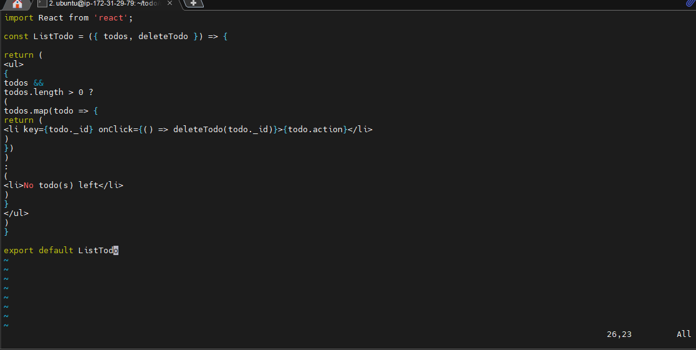

I aslo opened the Todo.js file and saved the following code inside.

 `import React, {Component} from 'react';
import axios from 'axios';

import Input from './Input';
import ListTodo from './ListTodo';

class Todo extends Component {

state = {
todos: []
}

componentDidMount(){
this.getTodos();
}

getTodos = () => {
axios.get('/api/todos')
.then(res => {
if(res.data){
this.setState({
todos: res.data
})
}
})
.catch(err => console.log(err))
}

deleteTodo = (id) => {

    axios.delete(`/api/todos/${id}`)
      .then(res => {
        if(res.data){
          this.getTodos()
        }
      })
      .catch(err => console.log(err))

}

render() {
let { todos } = this.state;

    return(
      

        <h1>My Todo(s)</h1>
        <Input getTodos={this.getTodos}/>
        <ListTodo todos={todos} deleteTodo={this.deleteTodo}/>
      

    )

}
}

export default Todo;`

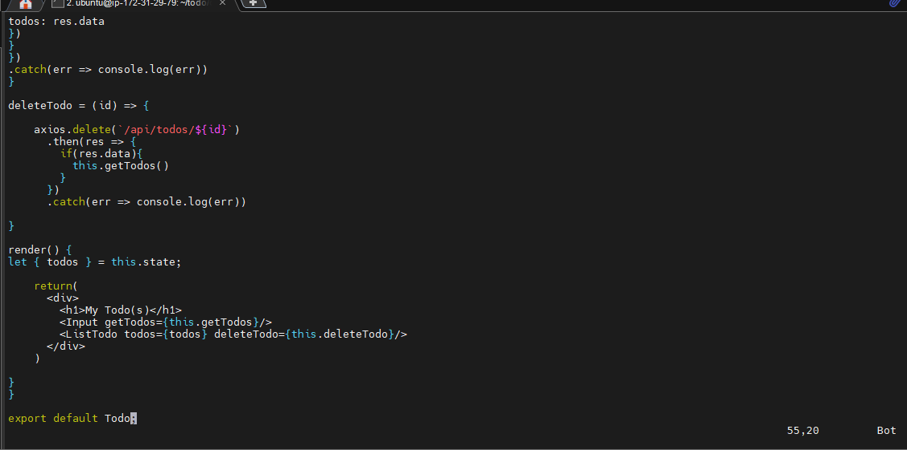

A little adjustment is needed to be made to the react app. The api.js file is opened and the logo is deleted and the following code added and saved into it.

`vi App.js`

`import React from 'react';

import Todo from './components/Todo';
import './App.css';

const App = () => {
return (

<Todo />

);
}

export default App;`

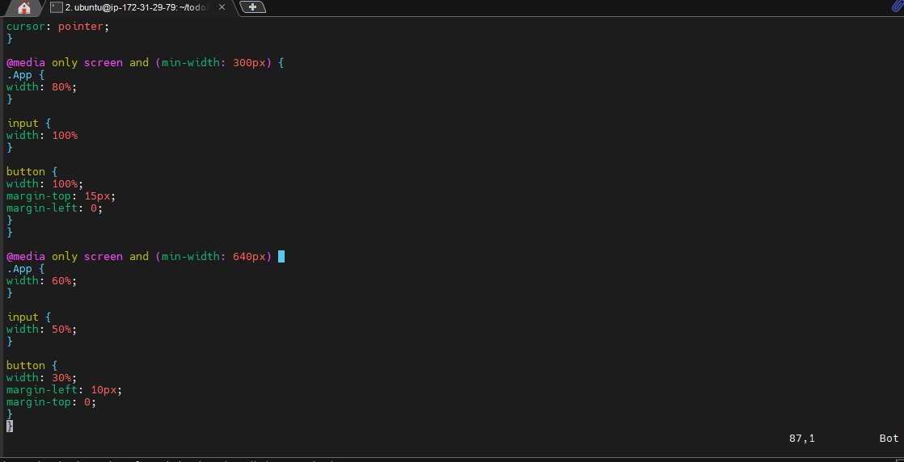

From the src directory, the App.css file was opened and the following code added and saved inside it.

`vi App.css`

`.App {
text-align: center;
font-size: calc(10px + 2vmin);
width: 60%;
margin-left: auto;
margin-right: auto;
}

input {
height: 40px;
width: 50%;
border: none;
border-bottom: 2px #101113 solid;
background: none;
font-size: 1.5rem;
color: #787a80;
}

input:focus {
outline: none;
}

button {
width: 25%;
height: 45px;
border: none;
margin-left: 10px;
font-size: 25px;
background: #101113;
border-radius: 5px;
color: #787a80;
cursor: pointer;
}

button:focus {
outline: none;
}

ul {
list-style: none;
text-align: left;
padding: 15px;
background: #171a1f;
border-radius: 5px;
}

li {
padding: 15px;
font-size: 1.5rem;
margin-bottom: 15px;
background: #282c34;
border-radius: 5px;
overflow-wrap: break-word;
cursor: pointer;
}

@media only screen and (min-width: 300px) {
.App {
width: 80%;
}

input {
width: 100%
}

button {
width: 100%;
margin-top: 15px;
margin-left: 0;
}
}

@media only screen and (min-width: 640px) {
.App {
width: 60%;
}

input {
width: 50%;
}

button {
width: 30%;
margin-left: 10px;
margin-top: 0;
}
}`

From the src directory again, the index.css file was opened and the following code added and saved inside it.

`vim index.css`

`body {
margin: 0;
padding: 0;
font-family: -apple-system, BlinkMacSystemFont, "Segoe UI", "Roboto", "Oxygen",
"Ubuntu", "Cantarell", "Fira Sans", "Droid Sans", "Helvetica Neue",
sans-serif;
-webkit-font-smoothing: antialiased;
-moz-osx-font-smoothing: grayscale;
box-sizing: border-box;
background-color: #282c34;
color: #787a80;
}

code {
font-family: source-code-pro, Menlo, Monaco, Consolas, "Courier New",
monospace;
}`

Now, back into out todo directory, the command below was ran to show the todo app is ready and fully functional with the functionality discussed earlier: creating a task, deleting a task and viewing all your tasks.

`npm run dev`

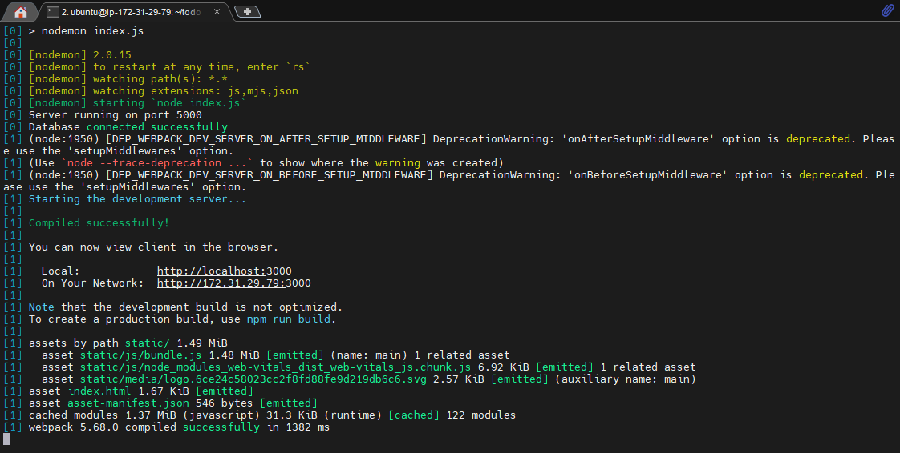

The screen shot below confirms the todo app is functional and can be assesed from the browser using localhost:3000

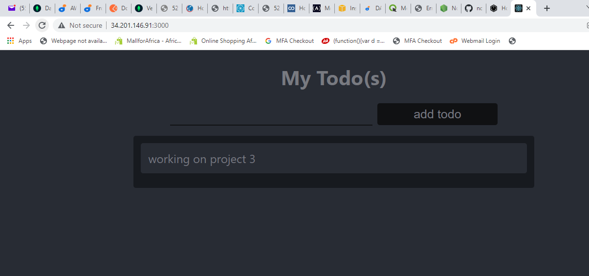