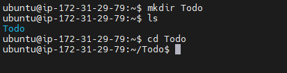

STEP 1- BACKEND CONFIGURATION

First, I updated and upgraded the Ubuntu server to the latest version with the following commands:

`sudo apt update`

`sudo apt upgrade`

The code below was used to get the location of Node.js software from Ubuntu repositories:

`curl -sL https://deb.nodesource.com/setup_12.x | sudo -E bash -`

Installed Node.js on the server using the code below. This command also installs npm:

`sudo apt-get install -y nodejs`

The node installation (node.js and npm) was  verified by running the codes below:

`node -v `

`npm -v `

I created a new directory named "todo" then ran a command to verify the directory was created and then changed from my current directory into the nwely created "todo" directory:

`mkdir Todo `

`ls `

`cd Todo`

