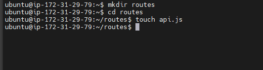

STEP 1- BACKEND CONFIGURATION

First, I updated and upgraded the Ubuntu server to the latest version with the following commands:

`sudo apt update`

`sudo apt upgrade`

The code below was used to get the location of Node.js software from Ubuntu repositories:

`curl -sL https://deb.nodesource.com/setup_12.x | sudo -E bash -`

Installed Node.js on the server using the code below. This command also installs npm:

`sudo apt-get install -y nodejs`

The node installation (node.js and npm) was  verified by running the codes below:

`node -v `

`npm -v `

I created a new directory named "todo" then ran a command to verify the directory was created and then changed from my current directory into the nwely created "todo" directory:

`mkdir Todo `

`ls `

`cd Todo`

the command below was used to intialize the projectso that a new file named package json will be created.This file conatins information about the application and the dependencies it needs to run.

A verification was then perfomed to confirm the package json was created:

`npm init`

These commands will install Express using npm and then create a file named index.js:

`npm install express`

`touch index.js`

Next, the dotenv module will be installed then that index.js file opened. The code wriiten below will be saved inside the index.js file.

`npm install dotenv`

`vim index.js`

`const express = require('express');
require('dotenv').config();

const app = express();

const port = process.env.PORT || 5000;

app.use((req, res, next) => {
res.header("Access-Control-Allow-Origin", "\*");
res.header("Access-Control-Allow-Headers", "Origin, X-Requested-With, Content-Type, Accept");
next();
});

app.use((req, res, next) => {
res.send('Welcome to Express');
});

app.listen(port, () => {
console.log(`Server running on port ${port}`)
});`

From the code above, port 5000 has been specified to be used. This will be confirmed when the terminal is opened from the index.js directory.

`node index.js`

Port 5000 was opened from the ECS security group on the EC2 AWS management console. I opened my browser to confirm access to my servers IP address followed by port 5000

In this next step, the Todo application will be shown to perform:
1. Create a new task
2. Display lists of all tasks
3. Delete a completed task

For each tasks, routes will be created that will define various end points that the todo app will depend on.

First, a folder called routes is created. Then we change from our current directory into the routes directory. Then a file named api.js is created.

`mkdir routes`

`cd routes`

`touch api.js`

The file api.js is opened and the following code is saved in it.

`vim api.js`

`const express = require ('express');
const router = express.Router();

router.get('/todos', (req, res, next) => {

});

router.post('/todos', (req, res, next) => {

});

router.delete('/todos/:id', (req, res, next) => {

})

module.exports = router;`

To install Mongoose, the dircectory will be changed from routes to todo. Mongoose is then installed with the command below:

`npm install mongoose`

A new folder named "models" is created. Directory is changed into the newly created "models" folder and then a file named todo.js is created inside the "models" folder using the command below:

`mkdir models && cd models && touch todo.js`

The file todo.js is opened and the code below is saved inside it.

`vim todo.js`

`const mongoose = require('mongoose');
const Schema = mongoose.Schema;

//create schema for todo
const TodoSchema = new Schema({
action: {
type: String,
required: [true, 'The todo text field is required']
}
})

//create model for todo
const Todo = mongoose.model('todo', TodoSchema);

module.exports = Todo;`

Next, the routes from the file api.js will be updated. Fisrt, from the the routes directory, the api.js file is opened and its present content deleted and the code below will be saved inside the file.

`vim api.js`

`const express = require ('express');
const router = express.Router();
const Todo = require('../models/todo');

router.get('/todos', (req, res, next) => {

//this will return all the data, exposing only the id and action field to the client
Todo.find({}, 'action')
.then(data => res.json(data))
.catch(next)
});

router.post('/todos', (req, res, next) => {
if(req.body.action){
Todo.create(req.body)
.then(data => res.json(data))
.catch(next)
}else {
res.json({
error: "The input field is empty"
})
}
});

router.delete('/todos/:id', (req, res, next) => {
Todo.findOneAndDelete({"_id": req.params.id})
.then(data => res.json(data))
.catch(next)
})

module.exports = router;`

A database is needed tp store data. Mlab provides MongoDB database as a service solution. To make this work i signd up for  shared clusters free account and completed the get started checklist.

Ealier, in the index.js file, dotenv was specified to access environment variables but the file was no created. The file shall be created now.

 A file named .env is created in the todo directory. This file is opened and a connaction string gotten from the clusters free account is saved inside it.

